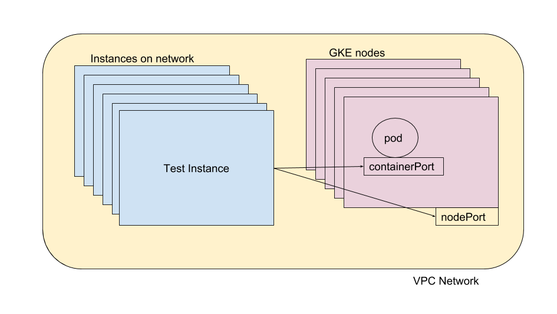

# IP aliasing

## Create a Network

```shell
gcloud beta compute networks create [NETWORK_NAME] --subnet-mode=custom
```

## Create a cluster

```shell
gcloud beta container clusters create [CLUSTER_NAME] \
    --network [NETWORK_NAME] \
    --enable-ip-alias \
    --create-subnetwork="" \
    --cluster-ipv4-cidr [RANGE] \
    --services-ipv4-cidr [RANGE]
```

I created a cluster and let GKE assign ranges. GKE created and ssigned `Pod address range` (`--cluster-ipv4-cidr `), and `Service address range`(`--services-ipv4-cidr`) ranges.

For my cluster, it simply means pods will fall within `10.60.0.0/14` and services will fall within `10.56.16.0/20` per the output below.

```console
$ gcloud container clusters describe neg-demo-z \
    --zone us-central1-a  \
    --format="table(servicesIpv4Cidr, clusterIpv4Cidr)"

SERVICES_IPV4_CIDR  CLUSTER_IPV4_CIDR
10.56.16.0/20       10.60.0.0/14
```

## Create a workload

use github.com/kmassada/gke-ingress-test to create workloads. This creates pods, service(clusterIP+NodePort). These are needed for testing IP Aliasing.

## Identify urls to test

The purpose of IP Alias is to have accessible endpoints, within my network. We will identify `nodeIP:nodePort`, as well as `podIP:containerPort` these endpoints should be accessible within the network (firewall rules permitting).

example:

Pod IP: `10.60.3.4` targetPort: `80`
Node IP: `10.56.0.2` nodePort: `31525`

### Identify a nodeIP:nodePort

```shell
kubectl get nodes -o=jsonpath='{.items[0].status.addresses[0]}'
```

Without `IP alias`, on cluster creation, your nodes' IP will still be within the specified network or default network. In our example we let GKE Provision the subnetwork for us: `--create-subnetwork="`.

Below you can see the subnetwork and secondary ranges created by GKE. we've already seen, the secondary ranges (CIDR ranges for pods and services), but the main range of this subnetwork is  `10.56.0.0/22`

```console
$ gcloud beta compute networks subnets list --filter="network:network-z" --format="flattened(name,ipCidrRange,secondaryIpRanges)"
---
ipCidrRange:                      10.56.0.0/22
name:                             gke-neg-demo-z-subnet-b704ca5e
secondaryIpRanges[0].ipCidrRange: 10.60.0.0/14
secondaryIpRanges[0].rangeName:   gke-neg-demo-z-pods-b704ca5e
secondaryIpRanges[1].ipCidrRange: 10.56.16.0/20
secondaryIpRanges[1].rangeName:   gke-neg-demo-z-services-b704ca5e
```

let's show an example of the nodes that were created within `10.56.0.0/22`

```console
$ kubectl get nodes -o=custom-columns=NAME:.metadata.name,InternalIP:.status.addresses[0]
NAME                                        InternalIP
gke-neg-demo-z-default-pool-0bc6b28f-257m   map[address:10.56.0.2 type:InternalIP]
gke-neg-demo-z-default-pool-0bc6b28f-4j3t   map[address:10.56.0.3 type:InternalIP]
gke-neg-demo-z-default-pool-0bc6b28f-5c3t   map[address:10.56.0.4 type:InternalIP]
gke-neg-demo-z-default-pool-0bc6b28f-g8tf   map[address:10.56.0.5 type:InternalIP]
gke-neg-demo-z-default-pool-0bc6b28f-h5jz   map[address:10.56.0.6 type:InternalIP]
```

Describing the service you created, prints both nodeport, endpoint, TargetPort (same with containerPort) in our example.

```shell
kubectl describe services/hey-service
```

trying it in my cluster, we print all related ports to our service

```console
$ kubectl get service/repro-service -o custom-columns=PORTS:.spec.ports
PORTS
[map[protocol:TCP port:80 targetPort:80 nodePort:31525]]
```

### Identify a podIP:containerPort

Note we are using as `metatada.labels` key and value `app: hey`, also this only works if you know your spec. this output assumes `containers[0].ports[0]` first container, first pod

```shell
 kubectl get pods -o jsonpath='{range .items[?(@.metadata.labels.app=="hey")]}{.status.podIP}{":"}{.spec.containers[0].ports[0].containerPort}{"\t"}{.metadata.name}{"\n"}'
```

Testing it in my cluster with `labels.app=="repro-nginx"`, pods (ie `10.60.3.4`) are falling within our `CLUSTER_IPV4_CIDR:10.60.0.0/14`.

With `PodIP`+`containerPort`, we've constructed endpoints you can access.

```console
$  kubectl get pods -o jsonpath='{range .items[?(@.metadata.labels.app=="repro-nginx")]}{.status.podIP}{":"}{.spec.containers[0].ports[0].containerPort}{"\t"}{.metadata.name}{"\n"}'
10.60.3.4:80    repro-nginx-857dc96dd9-8b2ps
10.60.0.12:80   repro-nginx-857dc96dd9-gtkvd
10.60.3.3:80    repro-nginx-857dc96dd9-pk458
10.60.3.9:80    repro-nginx-857dc96dd9-pt5b4
10.60.3.6:80    repro-nginx-857dc96dd9-z8qt9
```

this does the same

```shell
kubectl get endpoints
```

## Create instance whithin network

find cluster network

```shell
gcloud beta container clusters describe $CLUSTER_NAME --zone $ZONE --format json | jq '.| "\(.zone) \(.subnetwork) \(.network)"'
```

find image, ubunutu in our case

```shell
gcloud beta compute images list
```

create new instance

```shell
gcloud beta compute instances create instance-1 \
--zone=$ZONE \
--machine-type=n1-standard-1 \
--subnet=$SUBNET \
--network=$NETWORK \
--image=ubuntu-1710-artful-v20180612 \
--image-project=ubuntu-os-cloud \
--tags=gke-$CLUSTER_NAME-client
```

ssh and setup instance with `curl`

```shell
gcloud beta compute ssh instance-1 --zone=$ZONE
nstance-1:~$ sudo apt-get update && sudo apt-get install curl
```

## hit endpoints

```shell
# Pod IP: `10.60.3.4` targetPort: `80`
$ curl 10.60.3.4:80
# Node IP: `10.56.0.2` nodePort: `31525`
$ curl 10.56.0.2:31525
```

## Debug

the goal is outlined with the illustration below.



This rule will allow all tcp traffic into nodes all the nodes in the cluster: `gke-$CLUSTER_NAME-$ID-node`, coming from: nodes in the same network with this tag:`gke-$CLUSTER_NAME-client`.

```shell
gcloud compute firewall-rules create "gke-$CLUSTER_NAME-$ID-allow-clients" \
    --network $NETWORK \
    --direction INGRESS \
    --allow tcp \
    --source-tags=gke-$CLUSTER_NAME-clients \
    --target-tags=gke-$CLUSTER_NAME-$ID-node \
    --description="Allow traffic to cluster from gke-$CLUSTER_NAME-clients into gke-$CLUSTER_NAME-$ID-node"
```

This will work because on cluster creation and subnetwork/secondaryrange creation, there's a gateway, this gateway understands to route traffic to those secondaryranges properly.

However, the rule above makes it seem it is possible for any instance in the network to also reach the service IP range too. Yes, however the nodes do not know how to route this traffic. I tend to think of this as a feature. ClusterIP should only be for cluster bound routing.

When `curl <CLUSTER_IP>:targetPort` is issued, it is routed by the default gateway. if service is spread accross nodes, the same node will be picked. Essentially being the same as `curl <NodeIP>:NodePort`, defating the purpose of a cluster IP.

```console
user@gke-neg-demo-z-default-pool-0bc6b28f-257m ~ $ sudo -i
gke-neg-demo-z-default-pool-0bc6b28f-257m ~ # iptables-save > /tmp/out
gke-neg-demo-z-default-pool-0bc6b28f-257m ~ # cat /tmp/out | grep 10.56
...
-A KUBE-SERVICES -d 10.56.17.6/32 -p tcp -m comment --comment "default/neg-demo-app: cluster IP" -m tcp --dport 80 -j KUBE-SVC-FW5EL4YJC6GLX6ZU
-A KUBE-SERVICES ! -s 10.60.0.0/14 -d 10.56.24.97/32 -p tcp -m comment --comment "default/repro-service: cluster IP" -m tcp --dport 80 -j KUBE-MARK-MASQ
-A KUBE-SERVICES -d 10.56.24.97/32 -p tcp -m comment --comment "default/repro-service: cluster IP" -m tcp --dport 80 -j KUBE-SVC-QR3HS5AQNBJEOPZP
...
```